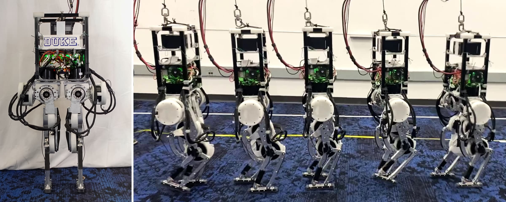

# The Duke Humanoid: Design and Control For Energy Efficient Bipedal Locomotion Using Passive Dynamics
Boxi Xia, 
Bokuan Li, 
Jacob Lee, 
Michael Scutari, 
[Boyuan Chen](http://boyuanchen.com/)
<br>
Duke University
<br>

<!-- <span style="font-size:17px; display: block; text-align: left;">
    <a href=TBD target="_blank" style="text-decoration: underline;">[Project Page]</a> 
    <a href=TBD target="_blank" style="text-decoration: underline;">[Video]</a>
    <a href=TBD target="_blank" style="text-decoration: underline;">[arXiv]</a> <br>
</span> -->

## Abstract
We present the Duke Humanoid, an open-source 10-degrees-of-freedom humanoid, as an extensible platform for locomotion research. The design mimics human physiology, with minimized leg distances and symmetrical body alignment in the frontal plane to maintain static balance with straight knees. We develop a reinforcement learning policy that can be deployed zero-shot on the hardware for velocity-tracking walking tasks. Additionally, to enhance energy efficiency in locomotion, we propose an end-to-end reinforcement learning algorithm that encourages the robot to leverage passive dynamics. Our experiment results show that our passive policy reduces the cost of transport by up to $50\\%$ in simulation and $31\\%$ in real-world testing. 

<br>
<a href="[YOUR_YOUTUBE_VIDEO_URL](https://www.youtube.com/watch?v=RZYkb09JurU)">
   
</a>
🌐 <a href="http://generalroboticslab.com/DukeHumanoidv1/" target="_blank">website</a>  |  
🎥 <a href="https://www.youtube.com/watch?v=RZYkb09JurU" target="_blank">video</a>  |  
🔧 <a href="https://www.notion.so/Duke-Humanoid-V1-38d54de887d1403a82f2367490c45b89" target="_blank">hardware wiki</a>


## project structure
```
.
├── control     # contains the hardware control code
├── doc
├── legged_env  # contains the simulation and RL code
├── LICENSE
└── README.md
```
## clone
Clone with submodules and follow the instructions in the respective submodules.
```bash
git clone --recurse-submodules https://github.com/generalroboticslab/DukeHumanoidv1.git
```
